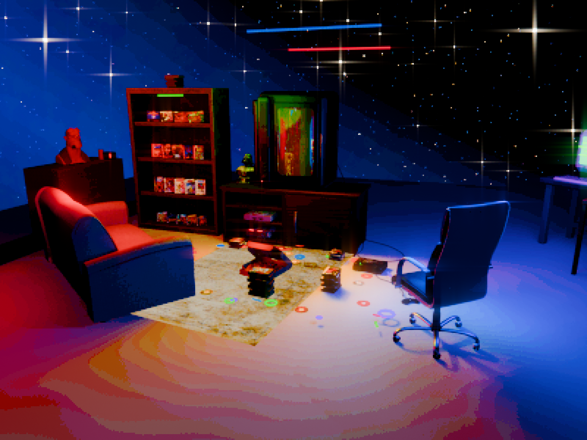

# Room scene

A lived-in retro game room in Blender: a portrait CRT playing video through a video-synth shader, sourced furniture and consoles, game cases and cartridges, a computer desk, pizza, and an animated star-filled void. The latest saved version includes saturated neon lighting and a PSX-inspired compositor.



## Download and open

**[Download the complete Blender scene](https://github.com/crestenstclair/room-scene/releases/download/v1.0.0/room-scene-v1.0.0.zip)** from the [v1.0.0 release](https://github.com/crestenstclair/room-scene/releases/tag/v1.0.0).

1. Extract the entire ZIP.
2. Open `room-scene/room-scene.blend` in **Blender 5.2 LTS**.
3. Keep `room-scene/media/tv-program.mp4` alongside the scene. It supplies both the TV picture and its soundtrack.
4. Press **F12** to render the current camera. The saved scene starts at frame **320**; output is **1200 × 900 at 60 FPS**.

Textures are embedded in the Blender file. Video uses a relative path. No Sketchfab login or Blender MCP connection is required to open the packaged scene.

The full scene is a release download because it is too large for regular Git. Cloning this repository or downloading GitHub's automatic **Source code** ZIP retrieves the documentation and tools, not the complete Blender package. No Git LFS setup is needed.

## Controls

Select a control object in Blender's Outliner, then open **Object Properties → Custom Properties**:

| Object | Purpose |
| --- | --- |
| `SHINRAWAVE_VIBE_CONTROLS` | Neon intensity, saturation, bloom, camera drift, void and accent-light effects |
| `ROOM_ANIMATION_CONTROLS` | Breathing, step-in, dust, rain, shooting stars, CRT bursts, steam, and audio response |
| `PSX_CAMERA_EFFECTS` | Pixelation, palette, chromatic offset, jitter, and effect strength |
| `TV_VIDEO_LIGHT_CONTROLS` | Video-colored illumination and flicker |

These are the controls present in the saved scene. Some legacy controls may not be fully wired; this upload preserves the scene rather than redesigning its effects. The separate CRT material and its existing synth controls remain in the Blender file.

Audio-reactive envelopes and sampled video-light colors are already baked for the supplied TV video. Replacing the media does **not** automatically reanalyze the new soundtrack or video colors.

## Optional command-line render

With Blender available on your command line:

```sh
blender --background /path/to/room-scene/room-scene.blend --python tools/render_still.py -- --output /path/to/render.png
```

Add `--frame 320` to choose a frame. The helper writes a PNG and does not save changes to the Blender project.

## Files and provenance

- [Package manifest](docs/package-manifest.json): exact packaged scene state and dependencies.
- [Asset credits](docs/asset-credits.md): source and creator records retained from the Blender scene.
- [Rights notes](docs/rights.md): personal-use artwork and third-party model licensing.
- [Verification](docs/verification.json): portable-file dependency and render checks.

This is a private project archive. Commercial game covers, disc labels, characters, and the gameplay capture are not relicensed as open-source content. Existing third-party credits are retained. No blanket license is asserted over the collection.
